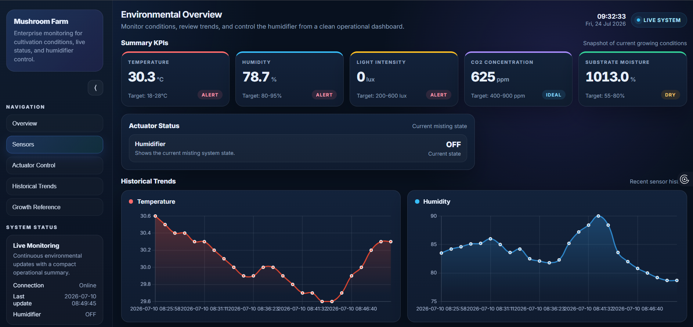

# IoT-Enabled Intelligent Environmental Control System for Mushroom Cultivation

An IoT and AI-based environmental control system developed to monitor and automatically regulate environmental conditions for mushroom cultivation.

## 📌 Project Overview

Mushroom cultivation requires controlled environmental conditions such as temperature, humidity, CO₂ concentration, soil moisture, and light intensity.

Traditional mushroom cultivation often relies on manual monitoring and control, which can be time-consuming and may result in unstable environmental conditions.

This project integrates:

- Internet of Things (IoT)
- Environmental sensors
- Raspberry Pi 4
- Machine Learning
- Firebase Realtime Database
- Web-based dashboard
- Automated misting control

The system collects real-time environmental data and uses a machine learning model to predict whether the misting system should be turned ON or OFF.

---

## 🎯 Aim

To design and implement an intelligent environmental control system for mushroom cultivation by integrating IoT-based sensing with AI-driven decision-making to optimize growth conditions and enhance productivity.

---

## 🎯 Objectives

1. Identify suitable AI methods for intelligent environmental control and determine key environmental parameters for mushroom cultivation.

2. Develop an IoT-enabled intelligent control system that integrates real-time sensor data with AI-based decision-making for automatic environmental regulation.

3. Evaluate the system in terms of prediction accuracy, resource efficiency, mushroom yield, and quality.

---

## 🏗️ System Architecture

The system consists of four main layers:

```text
┌─────────────────────────────┐
│       Sensing Layer         │
│                             │
│  DHT22                      │
│  MH-Z19B                    │
│  Capacitive Soil Moisture   │
│  TSL2591                    │
└──────────────┬──────────────┘
               │
               ▼
┌─────────────────────────────┐
│         Edge Layer          │
│                             │
│       Raspberry Pi 4        │
│                             │
│ • Sensor data processing    │
│ • ML inference              │
│ • Control logic             │
└──────────────┬──────────────┘
               │
               ▼
┌─────────────────────────────┐
│         Cloud Layer         │
│                             │
│    Firebase Realtime DB     │
│                             │
│ • Store sensor readings     │
│ • Real-time synchronization │
└──────────────┬──────────────┘
               │
               ▼
┌─────────────────────────────┐
│      Application Layer      │
│                             │
│       Web Dashboard         │
│                             │
│ • Live monitoring           │
│ • Historical trends         │
│ • Misting control           │
└─────────────────────────────┘
## 🔧 Hardware Components

| Component | Purpose |
|---|---|
| Raspberry Pi 4 | Main controller and edge computing device |
| DHT22 | Temperature and humidity measurement |
| MH-Z19B | CO₂ concentration measurement |
| Capacitive Soil Moisture Sensor | Substrate moisture measurement |
| TSL2591 | Light intensity measurement |
| Relay Module | Controls the misting actuator |
| Ultrasonic Misting Module | Maintains humidity during fruiting |

## 💻 Software & Technologies

### Programming & Development

- Python 3
- HTML
- CSS
- JavaScript
- Visual Studio Code

### Machine Learning

- scikit-learn
- XGBoost
- Random Forest
- pandas
- NumPy

### Cloud & Database

- Firebase Realtime Database

### Data Analysis

- Google Colab
- JSON dataset
- Chart.js

### Hardware Control

- Raspberry Pi GPIO
- RPi.GPIO

## 🏗️ System Architecture

The system consists of four main layers:

```text
Sensing Layer
     │
     ├── DHT22
     ├── MH-Z19B
     ├── Soil Moisture Sensor
     └── TSL2591
     │
     ▼
Edge Layer
     │
     └── Raspberry Pi 4
          │
          ├── Sensor Data Processing
          ├── Machine Learning Inference
          └── Control Logic
          │
          ▼
Cloud Layer
     │
     └── Firebase Realtime Database
          │
          ▼
Application Layer
     │
     └── Web Dashboard


Important: because this is Markdown, make sure the opening and closing triple backticks are there.

---

# 6. Add Data Collection

```markdown
## 📊 Data Collection

The system collects environmental data from multiple sensors.

### Input Features

- Temperature
- Relative Humidity
- CO₂ concentration
- Soil Moisture
- Light Intensity
- Time features such as hour and minute

### Output

The machine learning model predicts:

- Mist ON
- Mist OFF

Sensor readings are collected and uploaded to Firebase Realtime Database for storage and monitoring.

## 🧹 Data Preprocessing

The dataset was prepared using Google Colab.

The preprocessing workflow consisted of:

```text
Firebase Realtime Database
            │
            ▼
       Export JSON
            │
            ▼
     Import to Google Colab
            │
            ▼
Remove unnecessary attributes
       & timestamp
            │
            ▼
    Handle missing values
            │
            ▼
      Feature selection
            │
            ▼
     Train/Test Split


---

# 8. Add Machine Learning

```markdown
## 🤖 Machine Learning

Two machine learning classification algorithms were evaluated:

### Random Forest

Random Forest uses multiple decision trees and combines their predictions to classify the misting condition.

### XGBoost

XGBoost builds decision trees iteratively, with each new tree learning from the errors of previous trees.

### Evaluation Metrics

The models were evaluated using:

- Accuracy
- Precision
- Recall
- F1-score
- ROC-AUC
- Confusion Matrix

XGBoost achieved better overall performance and was selected for deployment.

## 📈 Model Performance

| Metric | Random Forest | XGBoost |
|---|---:|---:|
| Accuracy | 86.60% | 87.40% |
| Precision | 0.869 | 0.875 |
| Recall | 0.863 | 0.873 |
| F1-Score | 0.866 | 0.874 |
| ROC-AUC | 0.952 | 0.958 |

XGBoost achieved better overall performance and was selected for deployment on the Raspberry Pi 4.

## 🔍 Feature Importance

The XGBoost model showed that humidity was the most influential feature for predicting the misting status.

| Feature | Importance |
|---|---:|
| Humidity | 0.528 |
| Temperature | 0.274 |
| CO₂ | 0.198 |

Humidity had the strongest influence on the misting prediction.

## 🚀 AI Model Deployment

The trained XGBoost model was deployed directly onto the Raspberry Pi 4.

The deployment process was:

```text
Train XGBoost Model
        │
        ▼
Save Model as .pkl
        │
        ▼
Transfer Model to Raspberry Pi 4
        │
        ▼
Load Model
        │
        ▼
Read Real-Time Sensor Data
        │
        ▼
Predict Mist Status
        │
        ▼
Control Relay
        │
        ▼
Activate / Deactivate Misting Module
        │
        ▼
Upload Data to Firebase


---

# 12. Add Automated Misting

```markdown
## 💧 Automated Misting Control

The Raspberry Pi uses the machine learning prediction to control the misting system through a relay module.

```text
Environmental Sensors
        │
        ▼
   Raspberry Pi 4
        │
        ▼
  XGBoost Prediction
        │
        ▼
    Mist ON / OFF
        │
        ▼
   Relay Module
        │
        ▼
 Ultrasonic Misting Module


---

# 13. Add Web Dashboard

This is where I strongly recommend adding screenshots later.

```markdown
## 🌐 Web Dashboard

A web-based dashboard was developed for real-time monitoring of the mushroom cultivation environment.

### Dashboard Features

- Live sensor readings
- Temperature monitoring
- Humidity monitoring
- CO₂ monitoring
- Historical trend charts
- Environmental status
- Misting status
- Manual misting override

### Technologies

- HTML
- CSS
- JavaScript
- Chart.js
- Firebase Realtime Database

## 🌐 Web Dashboard

Here is the web dashboard developed for real-time monitoring:


